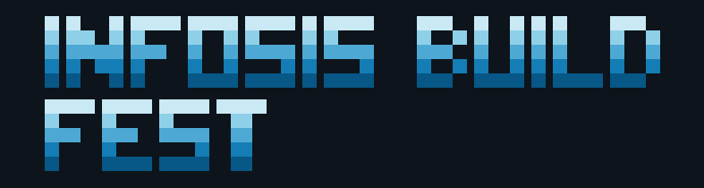

<a name="readme-top"></a>

<div align="center">



### Landing oficial del evento

Evento presencial de la carrera de Ingeniería Informática y Sistemas de la Facultad Integral del Chaco.

![Astro][astro-shield]
![TypeScript][typescript-shield]
![GSAP][gsap-shield]
![Lenis][lenis-shield]
![simple-icons][icons-shield]

</div>

## Tabla de contenidos

- [Sobre el proyecto](#sobre-el-proyecto)
- [Información del evento](#información-del-evento)
- [Características](#características)
- [Stack](#stack)
- [Arquitectura](#arquitectura)
- [Instalación](#instalación)
- [Desarrollo](#desarrollo)
- [Producción](#producción)
- [Contenido y personalización](#contenido-y-personalización)
- [Contacto](#contacto)

## Sobre el proyecto

Landing estática para presentar un workshop y un challenge de desarrollo web con OpenCode, Spec-Driven Development, Visual Studio Code, Git y GitHub.

La interfaz utiliza una estética oscura, editorial y pixelada, con componentes, animaciones, datos y recursos propios.

## Información del evento

- **Fechas:** 30 de septiembre y 1 de octubre de 2026.
- **Modalidad:** presencial.
- **Lugar:** laboratorio de cómputo de la Facultad Integral del Chaco.
- **Público:** estudiantes de la Facultad y público general.
- **Día 1:** workshop guiado, de 09:00 a 12:00 y de 14:30 a 17:30.
- **Día 2:** challenge de desarrollo web, de 09:00 a 15:00.
- **Inscripción:** 30 Bs para estudiantes de la Facultad y 50 Bs para público general.
- **Beneficios:** certificado de participación y refrigerio durante el segundo día.
- **Conocimientos previos:** no son necesarios.

## Características

- Hero con título pixelado `INFOSIS BUILD / FEST`.
- Lluvia de cursor en el hero y en la sección final de inscripción.
- Logo institucional monocromático y silueta en Canvas.
- Cards con lluvia pixelada sutil.
- Agenda organizada en dos cards, una por día.
- CTA final centrado con ambos precios y beneficios visibles.
- Header sticky con navegación, redes e inscripción.
- Footer enfocado únicamente en contacto.
- Scroll suave, revelado al hacer scroll y botón para volver arriba.
- Soporte para `prefers-reduced-motion` y navegación por teclado.
- SEO básico, Open Graph, favicon e identidad institucional.

## Stack

| Componente       | Tecnología              |
| ---------------- | ----------------------- |
| Framework        | Astro 7                 |
| Lenguaje         | TypeScript              |
| Estilos          | CSS propio y responsive |
| Animaciones      | GSAP                    |
| Scroll           | Lenis                   |
| Gráficos         | Canvas y SVG            |
| Iconos de marcas | `simple-icons`          |
| Package manager  | pnpm                    |
| Salida           | Sitio estático          |

## Identidad visual

La paleta está basada en el logo institucional de Ingeniería Informática y Sistemas:

| Color              | Hex       | Uso                              |
| ------------------ | --------- | -------------------------------- |
| Azul profundo      | `#075787` | Contraste y bloques oscuros      |
| Azul institucional | `#147db5` | Acciones y elementos principales |
| Azul hover         | `#2698cc` | Estados interactivos             |
| Celeste medio      | `#4da9d4` | Detalles y lluvia pixelada       |
| Celeste claro      | `#8fd0e9` | Iluminación y resaltados         |
| Rojo institucional | `#c51d2a` | Acento puntual tomado del logo   |

El logo pixelado del evento está en `public/evento.PNG` y el logo institucional en `public/ico-infosis.png`.

## Arquitectura

```text
Página Astro
  -> Layout y metadata SEO
  -> Navbar
  -> Hero y título pixelado
  -> Información del evento
  -> Tecnología y herramientas
  -> Agenda
  -> Inscripción
  -> Footer y contactos
```

### Organización física

```text
src/
├── components/
│   ├── Navbar.astro          # Navegación, redes y CTA
│   ├── Hero.astro            # Hero principal
│   ├── PixelTitle.astro      # Título SVG pixelado
│   ├── CursorRain.astro      # Lluvia asociada al cursor
│   ├── LogoSilhouette.astro  # Silueta institucional en Canvas
│   ├── Organizer.astro       # Franja de organización
│   ├── EventInfo.astro       # Resumen del evento
│   ├── PixelCard.astro       # Card con lluvia pixelada
│   ├── Tracks.astro          # Metodologías y herramientas
│   ├── Agenda.astro          # Agenda por día
│   ├── FinalCta.astro        # Inscripción final
│   ├── Footer.astro          # Contacto y redes
│   └── BackToTop.astro       # Retorno al inicio
├── data/event.ts             # Fuente de datos del evento
├── pages/index.astro         # Página principal
├── scripts/
│   ├── smooth-scroll.ts
│   └── scroll-animations.ts
└── styles/
    ├── global.css
    └── enhancements.css
```

## Secciones

### Header y hero

El header presenta el logo institucional, los enlaces Inicio, Evento, Tecnología, Agenda y Participa, iconos oficiales de WhatsApp, GitHub y TikTok, y el botón Inscribirme.

El hero muestra fechas, modalidad, descripción, CTAs, título pixelado, silueta institucional y lluvia de cursor.

### Qué es Build Fest

Explica que es un evento presencial de dos días para aprender a crear proyectos web, trabajar en equipo y resolver un reto. Sus cuatro cards presentan el aprendizaje práctico, el reto del segundo día, estudiantes de la Facultad y público general.

### Qué vas a aprender

Explica de forma sencilla cómo pasar de una idea a un proyecto web, usar OpenCode, conectar las distintas partes de una aplicación y trabajar con Visual Studio Code, Git y GitHub.

### Agenda

La agenda se divide en dos cards: Día 1 para el workshop guiado y Día 2 para el challenge de desarrollo web.

### Inscripción y footer

La llamada final mantiene la estética abierta del hero, con lluvia de cursor, contenido centrado, precios de **30 Bs** para estudiantes de la Facultad y **50 Bs** para público general, además de los beneficios incluidos. El botón **Inscribirme ahora** permanece pendiente de la definición del formulario.

El footer prioriza el contacto mediante WhatsApp, GitHub y TikTok.

## Instalación

```bash
git clone <url-del-repositorio>
cd infosis-build
corepack enable
pnpm install
```

## Desarrollo

```bash
pnpm dev
```

La landing queda disponible en `http://localhost:4321`.

```bash
pnpm dev      # Servidor de desarrollo
pnpm build    # Compilación estática de producción
pnpm preview  # Vista previa de la compilación
```

## Producción

```bash
pnpm build
```

El resultado se genera en `dist/` y puede publicarse en cualquier hosting compatible con sitios estáticos.

## Contenido y personalización

La información principal se edita en `src/data/event.ts`:

- Nombre, fechas, modalidad y sede.
- Público, descripción, precios, beneficios y prerrequisitos.
- Highlights, tracks y herramientas.
- Agenda.
- Contactos y redes.

Los estilos están en `src/styles/global.css` y `src/styles/enhancements.css`. Los logos y favicons están en `public/`.

## Contacto

- WhatsApp: `+591 67786830`.
- GitHub: <https://github.com/infosis-fich>.
- TikTok: <https://www.tiktok.com/@infosis.uagrm.fich>.

<p align="right">(<a href="#readme-top">volver arriba</a>)</p>

[astro-shield]: https://img.shields.io/badge/Astro-7-BC52EE?style=for-the-badge&logo=astro&logoColor=white
[typescript-shield]: https://img.shields.io/badge/TypeScript-5-3178C6?style=for-the-badge&logo=typescript&logoColor=white
[gsap-shield]: https://img.shields.io/badge/GSAP-3.15-88CE02?style=for-the-badge&logo=greensock&logoColor=white
[lenis-shield]: https://img.shields.io/badge/Lenis-scroll-101014?style=for-the-badge
[icons-shield]: https://img.shields.io/badge/simple--icons-16.31-111111?style=for-the-badge&logo=simpleicons&logoColor=white
